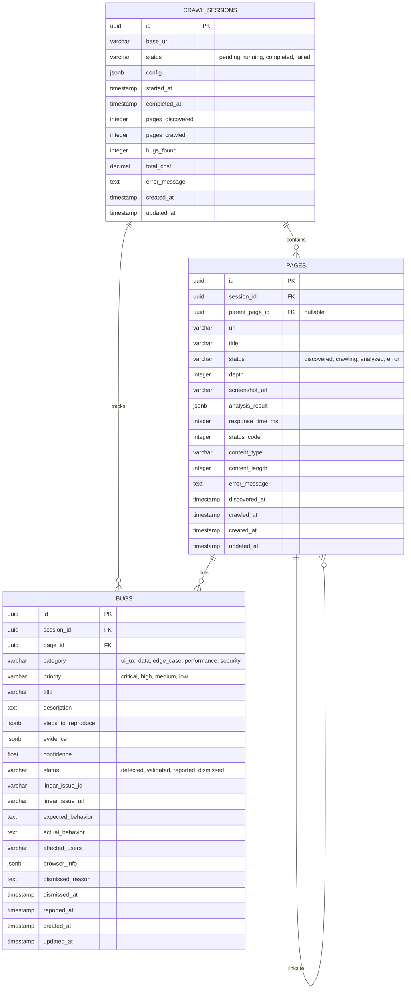
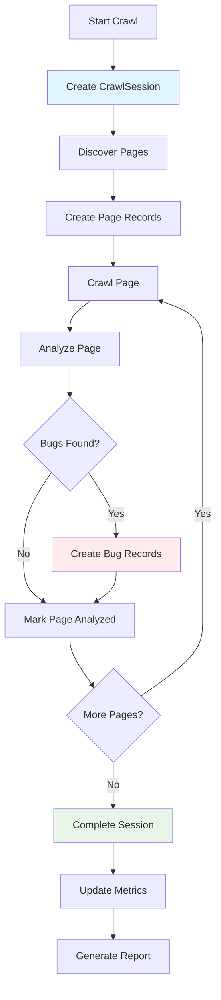

# BugHive Database Schema

## Entity Relationship Diagram



## Table Details

### crawl_sessions

**Purpose**: Track complete web crawl sessions with configuration and metrics.

**Relationships**:
- One-to-many with `pages` (cascade delete)
- One-to-many with `bugs` (cascade delete)

**Key Constraints**:
- `status` CHECK: Must be one of ('pending', 'running', 'completed', 'failed')
- `pages_discovered` CHECK: >= 0
- `pages_crawled` CHECK: >= 0
- `bugs_found` CHECK: >= 0
- `total_cost` CHECK: >= 0

**Indexes**:
```sql
CREATE INDEX idx_session_status_created ON crawl_sessions (status, created_at);
CREATE INDEX idx_session_base_url_status ON crawl_sessions (base_url, status);
```

**Example Record**:
```json
{
  "id": "550e8400-e29b-41d4-a716-446655440000",
  "base_url": "https://example.com",
  "status": "completed",
  "config": {
    "base_url": "https://example.com",
    "auth_method": "none",
    "max_pages": 100,
    "max_depth": 5,
    "excluded_patterns": ["/admin/*"]
  },
  "started_at": "2025-01-15T10:00:00Z",
  "completed_at": "2025-01-15T10:15:23Z",
  "pages_discovered": 47,
  "pages_crawled": 45,
  "bugs_found": 8,
  "total_cost": 2.35,
  "created_at": "2025-01-15T09:59:30Z"
}
```

---

### pages

**Purpose**: Store individual page crawl results and analysis.

**Relationships**:
- Many-to-one with `crawl_sessions` (via `session_id`)
- Self-referencing with `pages` (via `parent_page_id`)
- One-to-many with `bugs`

**Key Constraints**:
- `status` CHECK: Must be one of ('discovered', 'crawling', 'analyzed', 'error')
- `depth` CHECK: >= 0
- `response_time_ms` CHECK: >= 0
- `content_length` CHECK: >= 0
- UNIQUE INDEX on (`url`, `session_id`)

**Indexes**:
```sql
CREATE UNIQUE INDEX idx_page_url_session ON pages (url, session_id);
CREATE INDEX idx_page_session_status ON pages (session_id, status);
CREATE INDEX idx_page_session_depth ON pages (session_id, depth);
CREATE INDEX idx_page_crawled_at ON pages (crawled_at);
```

**Example Record**:
```json
{
  "id": "550e8400-e29b-41d4-a716-446655440001",
  "session_id": "550e8400-e29b-41d4-a716-446655440000",
  "parent_page_id": null,
  "url": "https://example.com/products",
  "title": "Products - Example Site",
  "status": "analyzed",
  "depth": 1,
  "screenshot_url": "https://storage.example.com/screenshots/abc123.png",
  "analysis_result": {
    "accessibility_score": 0.85,
    "performance_score": 0.92,
    "issues_found": 2
  },
  "response_time_ms": 234,
  "status_code": 200,
  "content_type": "text/html; charset=utf-8",
  "content_length": 45678,
  "discovered_at": "2025-01-15T10:05:00Z",
  "crawled_at": "2025-01-15T10:06:15Z"
}
```

---

### bugs

**Purpose**: Store detected bugs with evidence and lifecycle tracking.

**Relationships**:
- Many-to-one with `crawl_sessions` (via `session_id`)
- Many-to-one with `pages` (via `page_id`)

**Key Constraints**:
- `category` CHECK: Must be one of ('ui_ux', 'data', 'edge_case', 'performance', 'security')
- `priority` CHECK: Must be one of ('critical', 'high', 'medium', 'low')
- `status` CHECK: Must be one of ('detected', 'validated', 'reported', 'dismissed')
- `confidence` CHECK: >= 0.0 AND <= 1.0

**Indexes**:
```sql
CREATE INDEX idx_bug_session_priority ON bugs (session_id, priority);
CREATE INDEX idx_bug_session_category ON bugs (session_id, category);
CREATE INDEX idx_bug_session_status ON bugs (session_id, status);
CREATE INDEX idx_bug_page_priority ON bugs (page_id, priority);
CREATE INDEX idx_bug_confidence ON bugs (confidence);
CREATE INDEX idx_bug_linear_issue ON bugs (linear_issue_id);
```

**Example Record**:
```json
{
  "id": "550e8400-e29b-41d4-a716-446655440002",
  "session_id": "550e8400-e29b-41d4-a716-446655440000",
  "page_id": "550e8400-e29b-41d4-a716-446655440001",
  "category": "ui_ux",
  "priority": "high",
  "title": "Submit button overlaps text on mobile viewport",
  "description": "On mobile viewports (< 768px), the submit button overlaps the form label text, making it unreadable.",
  "steps_to_reproduce": [
    "Navigate to /products",
    "Resize browser to 375px width",
    "Scroll to contact form",
    "Observe button overlapping label text"
  ],
  "evidence": [
    {
      "type": "screenshot",
      "content": "https://storage.example.com/screenshots/overlap.png",
      "timestamp": "2025-01-15T10:06:20Z",
      "metadata": {
        "viewport": "375x667",
        "browser": "chromium"
      }
    },
    {
      "type": "console_log",
      "content": "{\"level\": \"warning\", \"message\": \"Layout shift detected\"}",
      "timestamp": "2025-01-15T10:06:21Z"
    }
  ],
  "confidence": 0.92,
  "status": "detected",
  "expected_behavior": "Button should be positioned below the text with proper spacing",
  "actual_behavior": "Button overlaps and obscures the label text",
  "affected_users": "Mobile users (< 768px viewport)",
  "browser_info": {
    "name": "chromium",
    "version": "120.0.6099.109",
    "platform": "linux",
    "user_agent": "Mozilla/5.0..."
  },
  "created_at": "2025-01-15T10:06:22Z"
}
```

---

## Data Flow Diagram



## Query Patterns

### Common Queries

#### 1. Dashboard: Get Active Sessions
```sql
SELECT id, base_url, status, started_at, pages_crawled, bugs_found
FROM crawl_sessions
WHERE status = 'running'
ORDER BY started_at DESC;
```
**Uses index**: `idx_session_status_created`

#### 2. Crawl Queue: Get Pages to Crawl
```sql
SELECT id, url, depth
FROM pages
WHERE session_id = ?
  AND status = 'discovered'
ORDER BY depth, discovered_at
LIMIT 10;
```
**Uses index**: `idx_page_session_status`

#### 3. Bug Report: Get High-Priority Bugs
```sql
SELECT b.*, p.url as page_url
FROM bugs b
JOIN pages p ON b.page_id = p.id
WHERE b.session_id = ?
  AND b.priority IN ('critical', 'high')
  AND b.confidence >= 0.8
  AND b.status = 'detected'
ORDER BY b.priority DESC, b.confidence DESC;
```
**Uses indexes**: `idx_bug_session_priority`, `idx_bug_confidence`

#### 4. Analytics: Bug Statistics by Category
```sql
SELECT
    category,
    COUNT(*) as total,
    AVG(confidence) as avg_confidence,
    COUNT(*) FILTER (WHERE status = 'reported') as reported
FROM bugs
WHERE session_id = ?
GROUP BY category;
```
**Uses index**: `idx_bug_session_category`

#### 5. Navigation Graph: Page Relationships
```sql
SELECT
    parent.url as parent_url,
    child.url as child_url,
    child.depth
FROM pages child
JOIN pages parent ON child.parent_page_id = parent.id
WHERE child.session_id = ?
ORDER BY child.depth, parent.url;
```
**Uses indexes**: `idx_page_session_depth`, primary key lookups

### Performance Characteristics

| Query | Expected Rows | Execution Time | Index Used |
|-------|--------------|----------------|------------|
| Get session by ID | 1 | < 1ms | Primary key |
| List active sessions | < 100 | < 5ms | `idx_session_status_created` |
| Get pages to crawl | 10-100 | < 10ms | `idx_page_session_status` |
| Count bugs by priority | 1-5 | < 3ms | `idx_bug_session_priority` |
| Get high-confidence bugs | 10-50 | < 10ms | `idx_bug_confidence` |
| Page analytics | 1 + N bugs | < 15ms | Multiple indexes |

## Storage Estimates

### Per-Session Estimates

**Assumption**: 100 pages crawled, 10 bugs found

| Table | Rows | Avg Size | Total |
|-------|------|----------|-------|
| crawl_sessions | 1 | 2 KB | 2 KB |
| pages | 100 | 5 KB | 500 KB |
| bugs | 10 | 8 KB | 80 KB |
| **Total** | 111 | - | **582 KB** |

### Scale Projections

| Sessions | Storage | Index Size | Total |
|----------|---------|------------|-------|
| 1,000 | 582 MB | ~150 MB | 732 MB |
| 10,000 | 5.82 GB | ~1.5 GB | 7.32 GB |
| 100,000 | 58.2 GB | ~15 GB | 73.2 GB |
| 1,000,000 | 582 GB | ~150 GB | 732 GB |

**When to consider partitioning**: > 10,000 sessions (7+ GB)
**When to consider sharding**: > 100,000 sessions (73+ GB)

## Backup Strategy

### Continuous Archiving
```bash
# Enable WAL archiving in postgresql.conf
wal_level = replica
archive_mode = on
archive_command = 'cp %p /backup/wal/%f'
```

### Point-in-Time Recovery
```bash
# Restore to specific time
pg_restore -d bughive -t "2025-01-15 10:30:00" backup.dump
```

### Backup Schedule
- **Continuous**: WAL archiving (1-minute RPO)
- **Daily**: Full database dump (4 AM UTC)
- **Weekly**: Full backup to cold storage (Sunday)
- **Retention**: 30 days hot, 1 year cold

## Monitoring Queries

### Health Check
```sql
SELECT COUNT(*) FROM crawl_sessions WHERE status = 'running';
```

### Table Sizes
```sql
SELECT
    schemaname,
    tablename,
    pg_size_pretty(pg_total_relation_size(schemaname||'.'||tablename)) AS size
FROM pg_tables
WHERE schemaname = 'public'
ORDER BY pg_total_relation_size(schemaname||'.'||tablename) DESC;
```

### Index Usage
```sql
SELECT
    schemaname,
    tablename,
    indexname,
    idx_scan,
    idx_tup_read,
    idx_tup_fetch
FROM pg_stat_user_indexes
WHERE schemaname = 'public'
ORDER BY idx_scan DESC;
```

### Slow Queries
```sql
SELECT
    query,
    calls,
    total_time,
    mean_time,
    max_time
FROM pg_stat_statements
WHERE dbname = 'bughive'
ORDER BY mean_time DESC
LIMIT 20;
```

## Future Enhancements

### Phase 1: Analytics Tables
```sql
CREATE TABLE bug_trends (
    date DATE PRIMARY KEY,
    total_bugs INTEGER,
    critical_bugs INTEGER,
    avg_confidence FLOAT,
    bugs_per_session FLOAT
);

CREATE INDEX idx_bug_trends_date ON bug_trends (date);
```

### Phase 2: Audit Trail
```sql
CREATE TABLE audit_log (
    id UUID PRIMARY KEY,
    user_id UUID,
    action VARCHAR(50),
    resource_type VARCHAR(50),
    resource_id UUID,
    changes JSONB,
    created_at TIMESTAMP DEFAULT NOW()
);

CREATE INDEX idx_audit_user ON audit_log (user_id, created_at);
CREATE INDEX idx_audit_resource ON audit_log (resource_type, resource_id);
```

### Phase 3: User Management
```sql
CREATE TABLE users (
    id UUID PRIMARY KEY,
    email VARCHAR(255) UNIQUE NOT NULL,
    name VARCHAR(255),
    role VARCHAR(50),
    created_at TIMESTAMP DEFAULT NOW()
);

ALTER TABLE crawl_sessions ADD COLUMN user_id UUID REFERENCES users(id);
CREATE INDEX idx_session_user ON crawl_sessions (user_id);
```

## Migration Checklist

When deploying schema changes:

- [ ] Review migration SQL for safety
- [ ] Test on staging database
- [ ] Benchmark query performance impact
- [ ] Create rollback plan
- [ ] Schedule during low-traffic window
- [ ] Monitor for 24 hours post-migration
- [ ] Update documentation
- [ ] Notify team of changes
